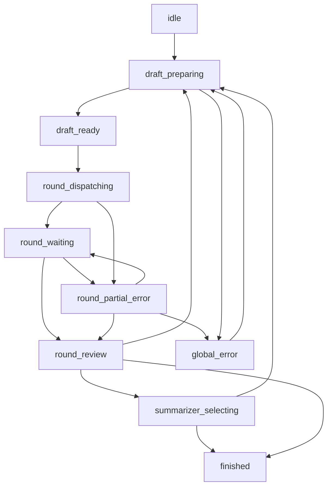

# SchemeChat 多 AI 讨论状态机设计 V1

## 文档目的
本文档用于定义 SchemeChat 在“多 AI 讨论控制台”模式下的状态机。

本文档只回答以下问题：

- 一场讨论从开始到结束会经过哪些状态
- 每个状态下用户能看到什么、能点什么
- 主按钮在不同状态下应该如何变化
- 多个 AI 的局部异常如何不拖垮整场讨论
- 2 AI、3 AI、更多 AI 时，状态机如何保持统一

本文档不讨论代码实现，不定义具体数据结构，不限定前端技术方案。

---

## 一、状态机设计目标

### 1. 保证用户始终知道“现在进行到哪一步”
系统不能只提供输入和发送。

用户必须能明确看到：

- 当前是第几轮
- 这一轮的目标是什么
- 哪些 AI 正在发言
- 哪些 AI 已完成
- 下一步推荐动作是什么

### 2. 保证主流程始终只有一个主按钮
状态机必须支撑“一个主按钮驱动讨论前进”的产品策略。

也就是说：

- 一个状态只对应一个主动作
- 用户不需要在多个同级按钮里猜下一步
- 调试类、补充类、修正类操作都降为辅助动作

### 3. 保证讨论可暂停、可纠错、可收束
状态机不能只覆盖理想路径，也必须覆盖：

- 单个 AI 回复失败
- 单个 AI 跑题
- 某个 AI 非常慢
- 用户想提前进入总结
- 用户想跳过某个 AI

### 4. 保证 2 AI 和 3 AI 以上共用一套骨架
2 AI 与 3 AI 以上的总结逻辑不同，但不能把整套状态机拆成两套。

更合理的方式是：

- 主骨架一致
- 只有“总结者选择”阶段的规则分支不同

---

## 二、状态机的两层结构

我建议状态机分成两层。

### 第一层：全局讨论状态
这一层描述整场讨论走到哪一步。

例如：

- 准备中
- 本轮 Draft 已生成
- 本轮发送中
- 本轮等待中
- 本轮已完成
- 选择总结者
- 最终总结中
- 已结束

### 第二层：单个 Provider 轨道状态
这一层描述每个 AI 当前是否参与、是否成功、是否静默。

例如：

- 待发送
- 生成中
- 已完成
- 失败
- 静默
- 跳过

这两层必须同时存在。

原因很简单：

- 全局讨论可以处于“本轮等待中”
- 但其中一个 AI 可能已经“已完成”
- 另一个 AI 可能还在“生成中”
- 第三个 AI 可能被标记为“静默”

如果没有双层状态，界面就会混乱。

---

## 三、全局讨论状态定义

## S0：`idle`

### 含义
还没有进入一场新的讨论，或者上一场讨论已经彻底结束。

### 用户可见内容

- 讨论主题输入区为空或显示上次内容
- 轮次模式可选
- 当前参与 AI 可见
- 默认规则 Tag 可见

### 主按钮

- `开始首轮`

### 辅助动作

- 编辑快捷文本
- 编辑常驻规则
- 调整轮次模式
- 调整参与 AI

### 进入条件

- 应用首次打开
- 用户手动结束当前讨论
- 一场讨论正常完成后回到准备态

### 离开条件

- 用户点击 `开始首轮`

---

## S1：`draft_preparing`

### 含义
系统正在根据当前模式、规则、参与者和轮次目标，生成本轮 Draft。

### 用户可见内容

- 控制台显示“正在生成本轮 Draft”
- 当前轮次标签可见
- Draft 编辑区暂时显示骨架或 loading 状态

### 主按钮

- `生成中`

主按钮在该状态下不可点击。

### 辅助动作

- `取消`

### 进入条件

- 用户从 `idle` 点击 `开始首轮`
- 用户从 `round_review` 点击下一阶段主按钮
- 用户从 `summarizer_selecting` 确认总结者后进入最终 Draft 生成

### 离开条件

- Draft 生成成功，进入 `draft_ready`
- Draft 生成失败，进入 `global_error`

---

## S2：`draft_ready`

### 含义
本轮要发给 AI 的 Draft 已经准备好，等待用户确认。

### 用户可见内容

- 当前轮次
- 本轮目标
- 本轮发言者范围
- Draft 完整文本
- 已启用规则 Tag
- 本轮引用材料

### 主按钮

- 首轮时：`发送首轮`
- 讨论轮时：`发送交叉讨论`
- 压缩轮时：`发送压缩轮`
- 最终轮时：`发送最终总结`

### 辅助动作

- `快捷文本`
- `常驻规则`
- `重生成草稿`
- `提前总结`
- `取消本轮`

### 进入条件

- `draft_preparing` 成功完成

### 离开条件

- 用户点击主按钮，进入 `round_dispatching`
- 用户取消，回到 `idle` 或 `round_review`

---

## S3：`round_dispatching`

### 含义
系统正在把本轮内容分发给当前应参与发言的 AI。

### 用户可见内容

- 每个 Provider 状态开始变化
- 控制台显示“正在发送本轮”

### 主按钮

- `发送中`

主按钮在该状态下不可点击。

### 辅助动作

- `取消发送`

### 进入条件

- 用户在 `draft_ready` 点击发送

### 离开条件

- 全部目标 Provider 成功接收，进入 `round_waiting`
- 至少一个目标 Provider 分发失败，进入 `round_partial_error`
- 全部分发失败，进入 `global_error`

---

## S4：`round_waiting`

### 含义
本轮消息已成功发出，系统等待当前轮次的 AI 回复完成。

### 用户可见内容

- 每个轨道显示状态
- 控制台显示“等待本轮完成”
- 已完成数量 / 总发言数量

### 主按钮

- `等待本轮完成`

主按钮在该状态下不可点击。

### 辅助动作

- `继续等待`
- `局部重试`
- `跳过该 AI`
- `提前总结`
- `取消本轮等待`

### 进入条件

- `round_dispatching` 完成

### 离开条件

- 所有本轮发言 AI 完成，进入 `round_review`
- 某个 AI 超时或失败，进入 `round_partial_error`
- 用户取消本轮，进入 `round_review` 或 `global_error`

补充说明：

- 本轮刚发出后，某个 AI 可能暂时还没有出现首段 assistant 回复；只要网页仍可读取且未出现明确站点错误，这属于正常等待态，不应直接判为失败

---

## S5：`round_review`

### 含义
本轮已经结束，系统完成抓取、整理和当前轮结果总结，等待用户决定下一步。

### 用户可见内容

- 本轮完成提示
- 本轮摘要
- 共识和分歧摘要
- 推荐下一步动作

### 主按钮

主按钮根据当前模式和轮次自动变化：

- 如果下一轮是交叉讨论：`开始交叉讨论`
- 如果下一轮是压缩轮：`进入压缩轮`
- 如果下一轮是总结阶段：`进入总结`
- 如果已经是最后一轮：`完成讨论`

### 辅助动作

- `局部重试`
- `屏蔽本段输出`
- `重生成摘要`
- `提前总结`
- `停止讨论`

### 进入条件

- `round_waiting` 正常完成
- `round_partial_error` 经用户确认后继续推进

### 离开条件

- 用户点击主按钮，进入下一次 `draft_preparing`
- 若进入总结者确认流程，进入 `summarizer_selecting`
- 用户停止讨论，进入 `finished`

---

## S6：`summarizer_selecting`

### 含义
讨论已经进入收束阶段，系统需要确认由谁输出最终总结。

### 用户可见内容

- 当前推荐总结者
- 投票结果或系统建议
- 非总结者将在最终轮静默的提示

### 主按钮

- `确认总结者`

### 辅助动作

- `改为手动指定`
- `重新投票`
- `双总结`
- `返回上一阶段`

### 进入条件

- 当前模式要求先确认总结者再进入最终轮

### 离开条件

- 总结者确认完成，进入 `draft_preparing`
- 用户返回，回到 `round_review`

---

## S7：`finished`

### 含义
整场讨论已经完成，最终结论已经产出。

### 用户可见内容

- 最终结论
- 论证路径摘要
- 遗留分歧
- 风险边界

### 主按钮

- `开始新讨论`

### 辅助动作

- `复制最终结论`
- `导出讨论记录`
- `复用当前规则再来一轮`
- 直接在底部输入区或工作台主题区输入下一题，系统应自动回到 `idle` 并保留可编辑状态

### 进入条件

- 最终总结轮完成
- 用户主动停止讨论并确认结束

### 离开条件

- 用户点击 `开始新讨论`，回到 `idle`

---

## S8：`round_partial_error`

### 含义
这不是整场讨论失败，而是当前轮次中有部分 AI 出现异常。

例如：

- 某个 AI 没发出去
- 某个 AI 一直没回复
- 某个 AI 回复明显异常

### 用户可见内容

- 哪个 AI 出问题
- 问题类型
- 当前其余 AI 是否已完成

### 主按钮

- `继续当前轮`

### 辅助动作

- `局部重试`
- `跳过该 AI`
- `将该 AI 设为静默`
- `返回重做本轮`

### 进入条件

- `round_dispatching` 或 `round_waiting` 中出现局部问题

### 离开条件

- 用户局部修正后回到 `round_waiting`
- 用户决定跳过后进入 `round_review`
- 用户决定重做本轮后回到 `draft_preparing`
- 如果问题扩大为全局不可继续，进入 `global_error`

---

## S9：`global_error`

### 含义
当前讨论无法按正常路径继续推进。

例如：

- Draft 生成失败
- 全部分发失败
- 当前轮无法判断是否完成
- 关键数据缺失

### 用户可见内容

- 明确错误信息
- 当前推荐恢复动作

### 主按钮

- `重试当前步骤`

### 辅助动作

- `返回上一状态`
- `结束本次讨论`

### 进入条件

- 关键步骤失败且不能自动降级

### 离开条件

- 重试成功，回到原有流程
- 用户结束，进入 `finished` 或 `idle`

---

## 四、单个 Provider 轨道状态定义

每个 AI 轨道都应该有自己的轻量状态。

## P0：`inactive`

### 含义
该 AI 当前不参与本场讨论。

### UI 表现

- 轨道保留
- 状态显示为 `未参与`

---

## P1：`ready`

### 含义
该 AI 参与本场讨论，等待本轮发送。

### UI 表现

- 状态显示为 `待发送`

---

## P2：`dispatching`

### 含义
系统正在向该 AI 注入本轮 Draft。

### UI 表现

- 状态显示为 `发送中`

---

## P3：`waiting`

### 含义
该 AI 已收到本轮内容，正在生成。

### UI 表现

- 状态显示为 `生成中`

---

## P4：`completed`

### 含义
该 AI 当前轮已完成且结果已抓取。

### UI 表现

- 状态显示为 `已完成`

---

## P5：`failed`

### 含义
该 AI 当前轮失败或超时。

### UI 表现

- 状态显示为 `失败`
- 显示局部处理入口

---

## P6：`muted`

### 含义
该 AI 仍在本场讨论中，但本轮不发言。

### UI 表现

- 状态显示为 `静默`
- 本轮不发送任何内容给它
- 本轮也不等待它完成

---

## P7：`skipped`

### 含义
该 AI 本轮被用户临时跳过，但未永久退出讨论。

### UI 表现

- 状态显示为 `已跳过`

---

## 五、推荐的轮次模板映射

状态机不直接写死“第 1 轮一定是什么语义”，而是通过轮次模式映射出每一轮的目标。

## 3 轮快速模式

### Round 1

- 阶段：独立分析
- 发言者：全员
- 目标：各自独立给出压缩方案

### Round 2

- 阶段：交叉讨论
- 发言者：全员
- 目标：阅读他方观点后修正自己判断

### Round 3

- 阶段：最终总结
- 发言者：总结者
- 其他 AI：静默

---

## 4 轮标准模式

### Round 1

- 阶段：独立分析

### Round 2

- 阶段：交叉讨论

### Round 3

- 阶段：压缩分歧
- 发言者：全员
- 目标：只保留关键分歧并确认收束方向

### Round 4

- 阶段：最终总结
- 发言者：总结者
- 其他 AI：静默

---

## 5 轮深度模式

### Round 1

- 阶段：独立分析

### Round 2

- 阶段：交叉质疑

### Round 3

- 阶段：修正方案

### Round 4

- 阶段：最终确认与选择总结者

### Round 5

- 阶段：最终总结
- 发言者：总结者
- 其他 AI：静默

---

## 六、状态切换事件定义

下面这些事件，是状态机真正需要响应的“触发器”。

## 用户事件

- `start_round_clicked`
- `send_round_clicked`
- `enter_summary_clicked`
- `confirm_summarizer_clicked`
- `retry_provider_clicked`
- `skip_provider_clicked`
- `stop_discussion_clicked`
- `start_new_discussion_clicked`

## 系统事件

- `draft_generated`
- `draft_generation_failed`
- `dispatch_succeeded`
- `dispatch_failed`
- `provider_completed`
- `provider_failed`
- `all_required_providers_completed`
- `summary_extracted`
- `final_round_completed`

---

## 七、关键守卫条件

状态机切换不能只靠按钮，还必须有守卫条件。

## G1：本轮必须存在有效 Draft

- Draft 不能为空
- Draft 不能只有空白

## G2：本轮至少有一个发言者

- 如果所有 AI 都被静默，本轮不能发送

## G3：进入总结前必须确定总结者

- 2 AI 时允许双总结
- 3 AI 以上默认单总结者

## G4：等待完成只统计“本轮发言 AI”

- `muted`
- `skipped`
- `inactive`

这些轨道都不应计入“等待完成数”。

## G5：局部异常不应自动升级为全局失败

- 单个 AI 出错优先进入 `round_partial_error`
- 只有关键步骤全面失败才进入 `global_error`

---

## 八、2 AI 与 3 AI 以上的分支规则

## 2 AI

### 总结者选择规则

- 可以让双方协商谁来总结
- 可以让用户直接指定
- 也可以允许双总结

### 状态机差异

- `summarizer_selecting` 阶段可以直接给出两个按钮：
  - `A 总结`
  - `B 总结`

必要时再提供：

- `双总结`

## 3 AI 及以上

### 总结者选择规则

- 优先投票或系统建议
- 用户有最终覆盖权

### 状态机差异

- `summarizer_selecting` 默认展示推荐总结者
- 用户可以点 `改为手动指定`

主骨架不变，只是进入 `draft_preparing` 前的确认方式不同。

---

## 九、主按钮映射表

为了保证真正只有一个主按钮，建议按状态映射：

| 状态 | 主按钮文案 |
| --- | --- |
| `idle` | `开始首轮` |
| `draft_preparing` | `生成中` |
| `draft_ready` | `发送本轮` |
| `round_dispatching` | `发送中` |
| `round_waiting` | `等待本轮完成` |
| `round_review` | `进入下一阶段` |
| `summarizer_selecting` | `确认总结者` |
| `finished` | `开始新讨论` |
| `round_partial_error` | `继续当前轮` |
| `global_error` | `重试当前步骤` |

注意：

- 文案对用户展示时，应根据轮次语义替换成更自然的中文
- 例如 `发送本轮` 应替换成 `发送首轮` 或 `发送交叉讨论`

---

## 十、推荐的状态机主路径

上面这个图强调的不是所有细节，而是三个原则：

- 正常路径反复在“生成 Draft -> 发送 -> 等待 -> 回看”中循环
- 总结阶段会单独插入“选择总结者”
- 局部错误优先局部修复，不立刻让整场讨论崩掉

---

## 十一、结论

我对这套状态机的核心判断是：

- 它必须先服务于“一个主按钮”的产品目标
- 它必须把“本轮可编辑 Draft”放在发送前
- 它必须把“局部错误”和“全局失败”分开
- 它必须把“总结者选择”视为独立阶段

如果按这套状态机继续往下做，后面最适合继续细化的文档就是：

- `讨论控制台信息架构`
- `Draft 装配规则文档`
- `Provider 轨道局部动作规范`

---

## 十二、自动运行模式补充

### 1. 自动运行不是另一套状态机
自动运行模式不应重新定义一套独立状态机。

更合理的方式是：

- 继续使用 `idle -> draft_preparing -> draft_ready -> round_dispatching -> round_waiting -> round_review -> summarizer_selecting -> finished`
- 只在“状态之间是否自动前进”这一层引入自动策略

也就是说，自动运行模式是同一套状态机上的“自动推进策略”，而不是另一套流程图。

### 2. 自动运行的状态控制字段
为了支持自动推进，状态机还应增加一些控制字段：

- `run_mode`
  - `manual`
  - `auto`
- `auto_run_enabled`
- `auto_pause_reason`
- `auto_run_policy`
- `auto_run_started_at`

这些字段不是新的业务状态，而是全局控制上下文。

### 3. 自动运行下的状态推进规则

#### `idle -> draft_preparing`
- 手动模式：用户点击 `开始首轮`
- 自动模式：用户点击 `自动完成`

#### `draft_preparing -> draft_ready`
- 两种模式共用

#### `draft_ready -> round_dispatching`
- 手动模式：用户确认 Draft 后点击主按钮
- 自动模式：系统生成成功后自动发送当前轮

#### `round_waiting -> round_review`
- 两种模式共用
- 条件仍然是“本轮应发言 AI 已完成或已被跳过”
- 自动模式下，“已完成”必须指网页已结束生成且稳定结果抓取成功；仅凭轮询检查缓存不得推进到下一状态

#### `round_review -> draft_preparing`
- 手动模式：用户点击下一步
- 自动模式：系统自动生成下一轮 Draft

#### `summarizer_selecting -> draft_preparing`
- 手动模式：用户确认总结者
- 自动模式：系统按既定策略自动确认总结者

### 4. 自动运行下的默认自动动作
当系统处于自动运行模式时，应默认自动执行：

- 当前轮 Draft 生成成功后自动发送
- 当前轮全员完成后自动进入复盘
- 复盘完成后自动进入下一轮
- 达到收束条件后自动进入总结
- 最终轮完成后自动进入 `finished`

### 5. 自动运行下不应自动越过的情况
以下情况不应被静默吞掉，而应暂停自动流程：

- 某个 AI 长时间未完成
- 某个 AI 当前轮抓取失败
- 某个 AI 当前轮回复为空或明显异常
- 无法判断本轮是否完成
- 总结者无法按策略确定

这类情况说明“自动运行被阻塞”，不适合继续盲推。

## S10：`auto_paused`

### 含义
自动运行模式下，系统因异常、歧义或等待超时而暂停，等待用户介入。

### 用户可见内容

- 当前停在第几轮
- 哪个 AI 出现问题
- 暂停原因
- 当前已完成的 AI 数量
- 系统建议的下一步

### 主按钮

- `继续自动运行`

### 辅助动作

- `跳过该 AI`
- `改为手动接管`
- `直接进入总结`
- `重试当前轮`
- `停止讨论`

### 进入条件

- 自动运行模式下，`round_waiting`、`round_review`、`summarizer_selecting` 或 `round_partial_error` 无法继续自动推进
- 自动等待阶段发现某个 AI 仍显示生成中，但回复文本长时间不再变化；系统应暂停，而不是把它当作本轮已完成
- 自动等待阶段发现某个 AI 虽然显示已结束，但稳定抓取失败或结果为空；系统应暂停，而不是用截断结果继续装配下一轮

### 离开条件

- 用户确认继续，回到原先被暂停的状态
- 用户切换为手动模式，回到对应手动状态
- 用户直接结束讨论，进入 `finished` 或 `global_error`

### 6. 自动运行的状态机原则
- 自动模式仍必须让用户知道“当前进行到哪一步”
- 自动模式不是隐藏状态，而是显式可见的运行状态
- 自动模式下的主按钮语义从“推进”改为“暂停 / 接管 / 恢复”
- 自动模式一旦被阻塞，优先进入 `auto_paused`，而不是直接进入 `global_error`
## V1 补充：`auto_paused` 下的跳过推进规则

当系统处于 `auto_paused` 时，`跳过该 AI` 在 V1 中遵循以下约束：

- 只有当当前轮至少已有 1 个 AI 完成稳定回复时，跳过动作才允许执行
- 被跳过的 AI 仅对当前轮标记为 `skipped`
- 跳过后，当前轮以保留下来的结果进入 `round_review`
- 如果跳过后当前轮只剩 1 个可用结果，系统不再继续新的交叉轮，而是直接收束到 `final-summary`

这条规则的目标是避免“只剩 1 个 AI 却继续做多方交叉讨论”的伪流程。
